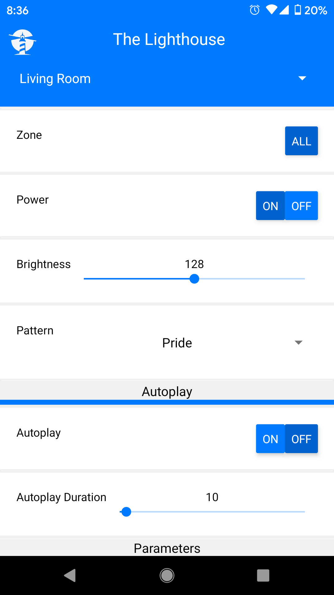

# esp8266-fastled-mobile-app
A react native app for controlling LEDs running via my [fastled interface](https://github.com/Tiuipuv/esp8266-fastled-dedicated-webserver/tree/master/esp8266-fastled-sketch). This serves as a replacement for having to host the [basic web interface](https://github.com/Tiuipuv/esp8266-fastled-dedicated-webserver/tree/master/Web%20Server) and access it via browser.

## Installation
 * Install NodeJS `v24.x` or higher
 * Run `npm i --legacy-peer-deps`
 > Note: The legacy peer deps flag is temporary until @rneui gets their library at 5.X figured out

## Running locally
The following scripts are available and scaffolded out by expo:
 * `npm start`: run the expo server, making the app available in development mode (generic)
 * `npm run android`: run the expo server specifically for android devices
 * `npm run ios`: run the expo server specifically for ios devices (untested)
 * `npm run web`: run the expo server specifically for web (untested)

 Once the server is started, scan the QR code with the [Expo Go App](https://play.google.com/store/apps/details?id=host.exp.exponent&hl=en_US&pli=1) and wait for the app to bundle.

